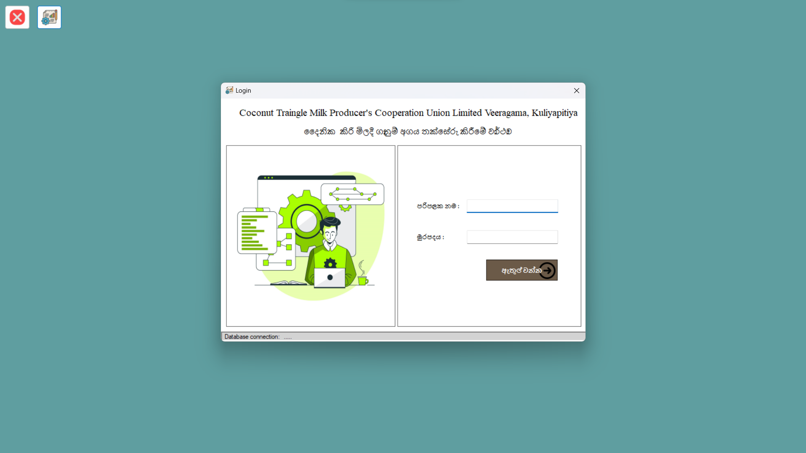

# Milk Collection Management System

The Milk Collection Management System is a comprehensive .NET desktop application designed specifically for a milk collecting company. It provides efficient and streamlined management of milk collection operations, enabling the company to effectively track and manage the collection, processing, and distribution of milk from various sources.

